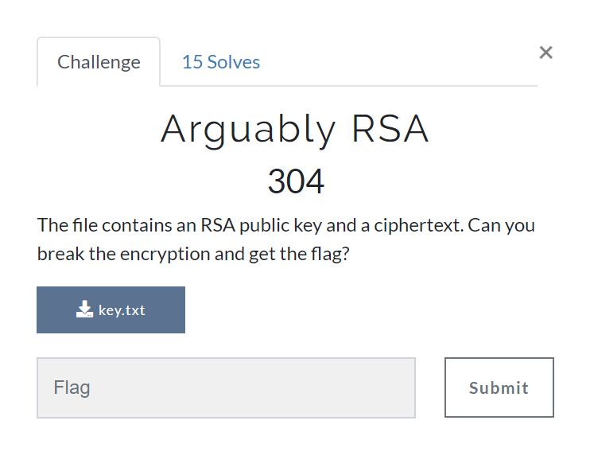
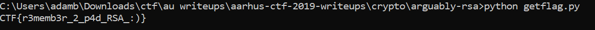
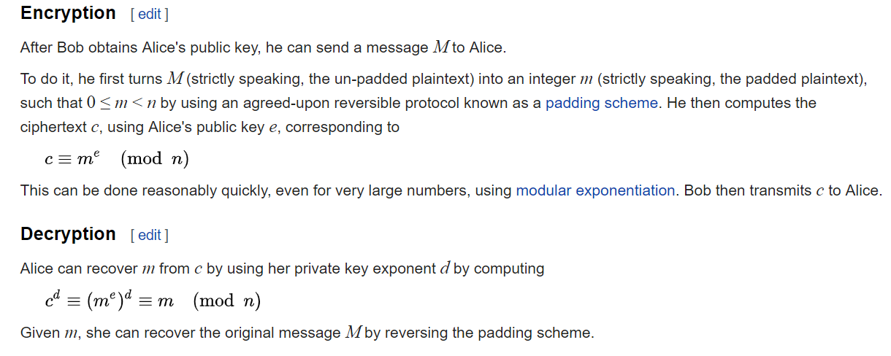

# Repeated XOR 2: Electric Boogaloo
## Challenge Information

* CTF name: Aarhus CTF, 10/05/2019
* Team name: Sweaty Blanket Monsters
* Challenge name: Arguably RSA
* Challenge description: The file contains an RSA public key and a ciphertext. Can you break the encryption and get the flag?
* Challenge category => Crypto
* Challenge points => 304/500, (15 teams solved)

## Arguably RSA

The contents of the flag.txt file was as follows:

>e: 3
>n: 23230858688205611538251663108799097010232382220939344003599883464604060850825151701191125199993097076202170151361378290217507520524506951256606221926980158517787731507525671682338559299965980393273669977958243970432399650860275539477180932772453595960567140053422393238809398884649967773986568728537946775189048321075385387420540714641419957820239640132101781787852773978258282487622673443406499519892489638354702060728607658364754933153392402807723692077172518894619306603835166359649935139690470606041364577365410420797510402488483107631745868004839425659892920566524018370947739585226818351021068954174186671493219
>c:
1266507512685188734024296480701217581859146439942347294025678664710736028242110814178564722387216936848563225483182112016293134304921336892062989162597050141119966157468365997335060553829

Looking at this file, there doesn't seem to be anything obviously wrong with n, and it shows up as not cracked on factordb.

This leaves the ciphertext, and e = 3.

After a few attempts to crack n through various factorisation attack with no luck, i decided to have a go at the cyphertext.

Noting that e = 3, I know that if the flag isn't padded, it may be possible to simply decrypt ti without the key.

I took the third root of c, and converted it from decimal to ascii, and there was the flag :)

I've cleaned up a short python script which takes c, finds the third root, converts the decimal number to binary, then converts the binary to ascii, and prints the flag.  This script can be found [here](getflag.py).

## RSA
A brief explanation of the theory/googling required to solve this exercise.

Below is the wikipedia explanation of RSA encryption and decryption, given three numbers, e, d and n. Generally e and n are publically known, and d is the secret key which can decrypt messages. Due to some math used when choosing n and d, the below equations are true.

From the encryption section we can see that the cipher, c, is given by taking modulo n of plaintext, m, raised to the power of e.

In our example, because the message was just the flag, the decimal representation of the flag raised to the third power was still shorter than n, and as such, the modulo operator did nothing.

This leaves the very simple equation, $c = m^3$, which is trivially solveable as we know c.

This highlights an important aspect of RSA, which is that the text you wish to encrypt raised to the public exponent, e, must be larger than n. In cases where you want to use e = 3, (mainly where you want to encrypt really quickly/cheaply, for example mobile devices,) then for short inputs, take care to pad your plaintext such that $m^e > n$.

---
*Writeup by Adam B. Hansen*
*https://github.com/killerdogice/CTF-Files/tree/master/writeups*
