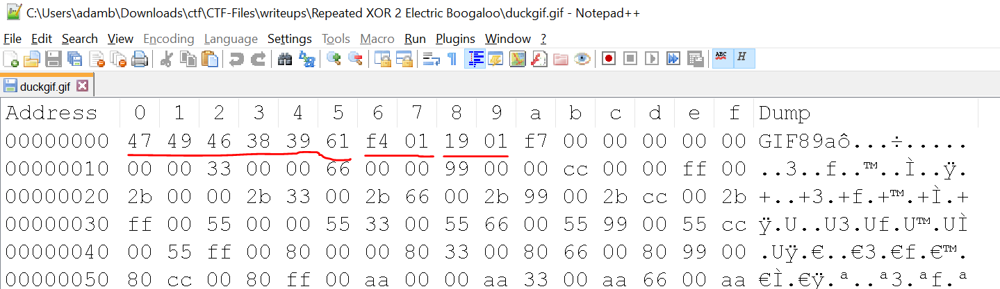

# Repeated XOR 2: Electric Boogaloo
## Challenge Information

CTF name: Aarhus CTF, 10/05/2019  
Team name: Sweaty Blanket Monsters
Challenge name: Repeated XOR 2: Electric Boogaloo  
Challenge description: Decrypt 500x281 image encrypted by 10 byte repeating xor encryption  
Challenge category => Crypto  
Challenge points => 499/500, (2 teams solved)

*Writeup by Adam B. Hansen*

## Repeated XOR 2: Electric Boogaloo
The challenge gave us a binary file called "flag.bin", and the following description.  
> Here's another repeated XOR encryption. The key is 10 bytes and the plaintext is a 500x281 image.  

This gives us several important pieces of information from which to start.  
1. The encryption is *repeating XOR* with a *10 byte key*. This means if we can find the key, we simply have to repeatedly XOR the flag.bin file with it to decrypt it, and hopefully claim our flag.  
2. The file is a 500x281 pixel image file. This means that, unlike the previous XOR challenge which had an english language plaintext, we can't use letter frequencies or knowledge of ascii characters to carry out an analysis.  
On the other hand, this likely limits it to one of the common images types like .jpeg, .png, .gif, .bmp etc.
3. An important note about the XOR operator. It is commutative, associative, and cancels itself out. As such, A XOR B XOR A = B. This means if we can identify any 10 byte sequence in the original plaintext, we can XOR that known sequence with the same 10 bytes in the *flag.bin* file and get the cypher key as the result.

I then started researching common image file formats, to see if any had a consistent 10 byte pattern in them i could use to find the XOR key. I started by taking a picture of a duck from google images, and used ms paint to resize it to be 500x281 pixels, before exporting it into several different image formats, including .png .jpg and .gif

[According to the spec,](http://www.libpng.org/pub/png/spec/1.2/PNG-Structure.html) the first 8 bytes of a png image are always '89  50  4e  47  0d  0a  1a  0a'. I opened my duckpng.png file in notepad++ with a hex editor plugin, and found it matched, followed by '00 00'. I tried using this with the 'flag.bin' file, but no luck.  

Next I looked at .jpg, which [according to spec](https://www.file-recovery.com/jpg-signature-format.htm) always starts with the 10 bytes 'ff d8 ff e0 20 10 4a 46 49 46 20'. This again matched the hex code in duckjpg.jpg, but again no luck trying to decrypt the flag.

The third file type was .GIF  
[According to spec](https://www.file-recovery.com/gif-signature-format.htm), a GIF file header consists of 6 bytes identifying the file format, 2 bytes giving the width, and two bytes giving the height. Given that we are specifically told the width and height of the image, this seems promising.

Looking into my duckgif.gif file, which was specifically designed to be 500x281 pixels, I see the same 6 byte identifier, '47 49 46 38 39 61', This is followed by the hex value for 500, '01f4', and the hex for 281, '0119'. (Bytes reversed due to endian.)  

XOR'ing this with the first 10 bytes of the *flag.bin* file using an [online xor calculator](http://xor.pw) gives the hex encoding of the ascii string "key=Banana."  

Now all that's left is to XOR the flag.bin file by the byte representation of this string. It was 4am, so I just repeatedly pasted "key=Banana" into a notepad++ document and saved it as *key.bin*, making sure the file was larger than the image file. I then reused some code I found for an earlier challenge which XOR'd two files. This code is given above in the file [*xorfiles.py*](xorfiles.py).

Running this code with the arguments `> python xorfiles.py flag.bin key.bin output.gif` creates the output.gif file which is as follows.

And incase the picture is too hard to read, the key is also present in text form inside the code of the file. 

Overall an interesting, but not too theoretically or technically challenging flag. I assume the reason it had so few solves was mainly because it came out quite late during the event, and a lot of teams had probably been scared away from the later crypto puzzles by some of the more theoretically complex challenges which were released before it.

---
*Writeup by Adam B. Hansen*
*https://github.com/killerdogice/CTF-Files/tree/master/writeups*
