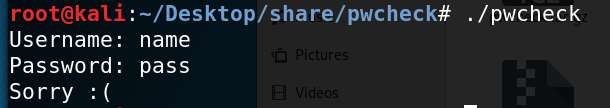
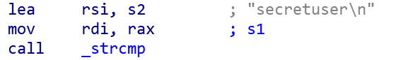
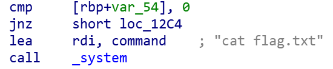
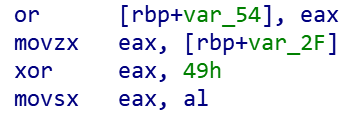
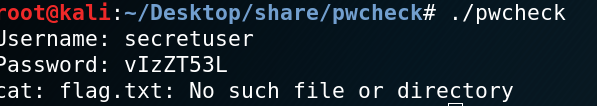

# pwcheck

## Challenge description
> A simple but very secure authentication service.

## Solution
This is my solution to the pwcheck reversing challenge. First i just extract the pwcheck executable and run it. It promts the user for a username and a password.

I like to use static analysis to begin with to get an overview of what a program does and many times there is no need to use a debugger. So i open the file in IDA.

Looking in the disassembled main function i immediately see the calls to printf and gets. So now we know whre the input and output is so far. After the I/O is done there is a string comparison:

As you can see in the comment after s2 "secretuser" is one of the arguments when performing the comparison. The rdi register most likely will hold the address of the username submitted during runtime. Continuing down in the program to near its end we see our goal, the system call to print the flag. Just above it is a check and a jump instruction. The jump leads further down where "Sorry :(" is printed. So if the comparison fails it means the wrong password has been submitted.

All thats left is to find out how to pass the check above. Looking at the code preceeding the check there is a lot of bitwise operations going on.

A large block of this quickly gets a bit confusing BUT its fairly common to use operations such as these to zero out registers like: xor eax, eax. The xor seen in the code is used to check if eax holds the same value as 49 hex. Going on like this its basically a series of if statements and as long as they are all correct the final test should succed.
All we have to do to win is to see what  ASCII values the hex corresponds to. Putting them together we get the string: vIzZT53L.

Since i ran this locally there was no flag file :( but it worked!

---
*Writeup by Mathias Karlsson*