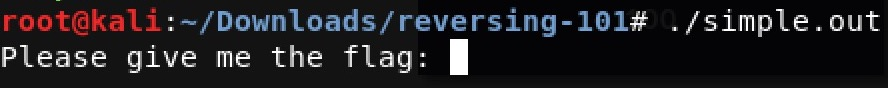
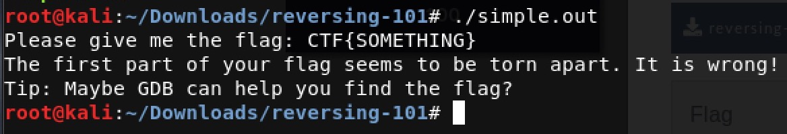
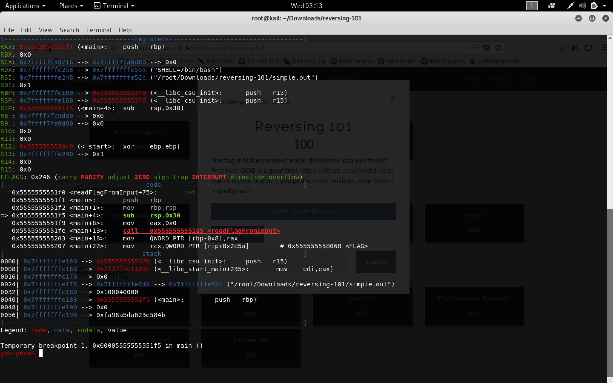
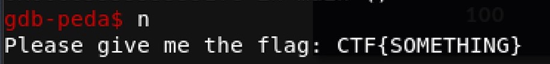
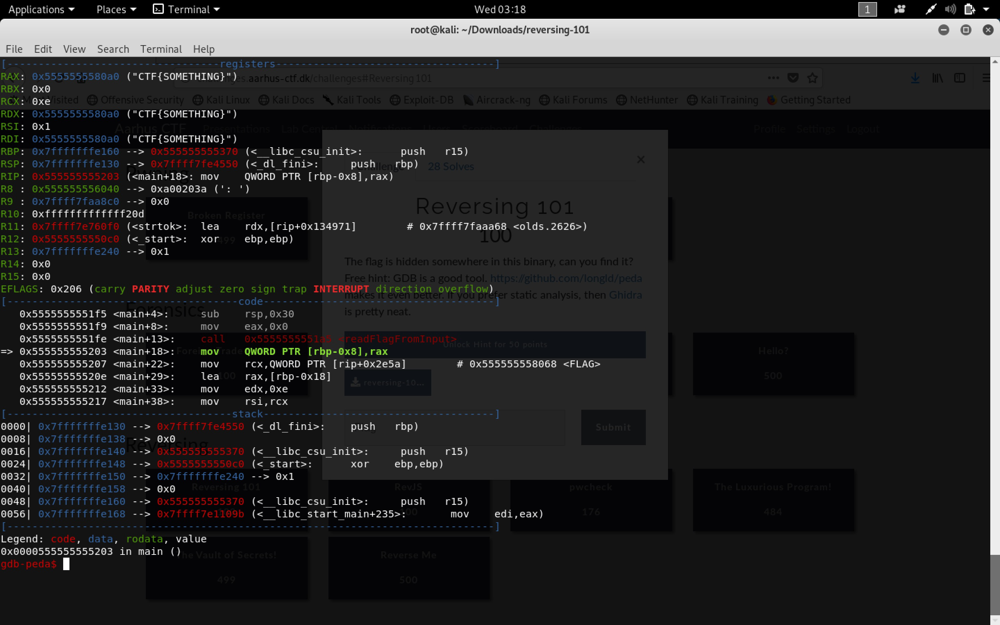
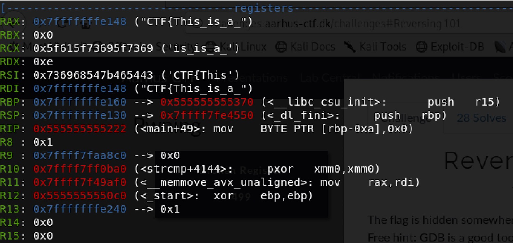
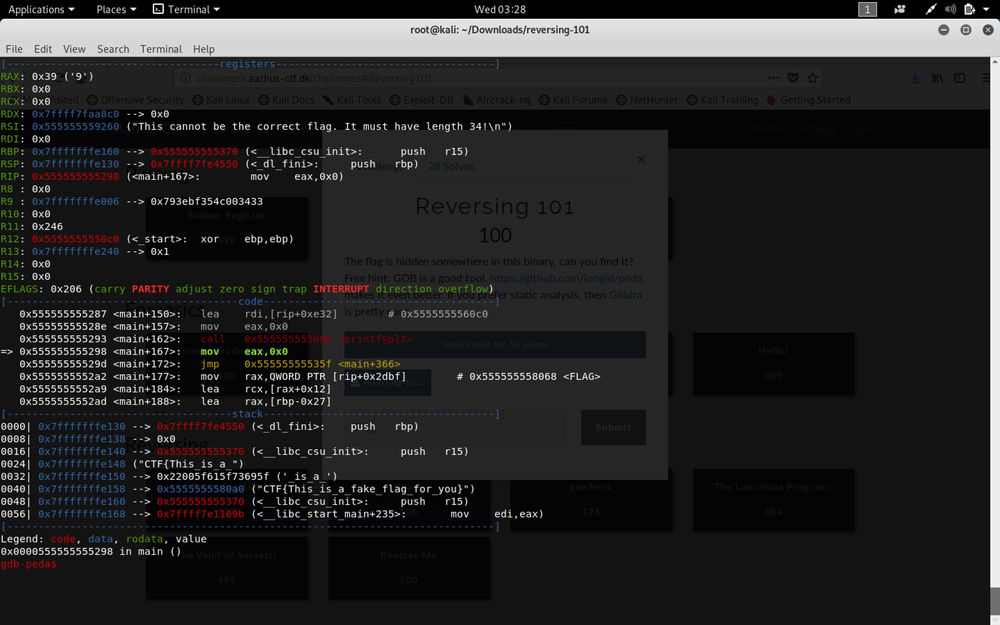
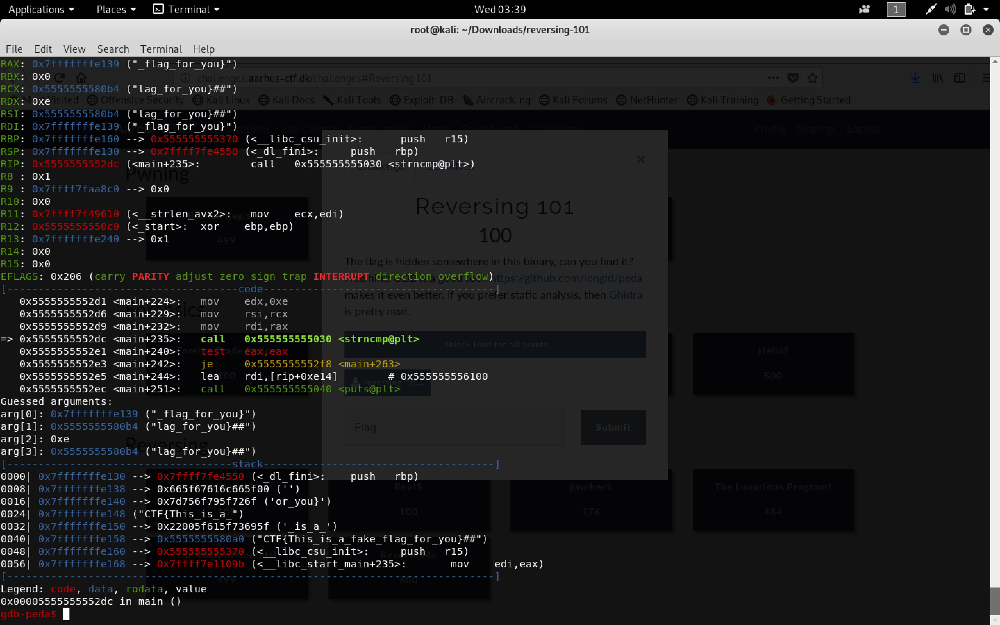
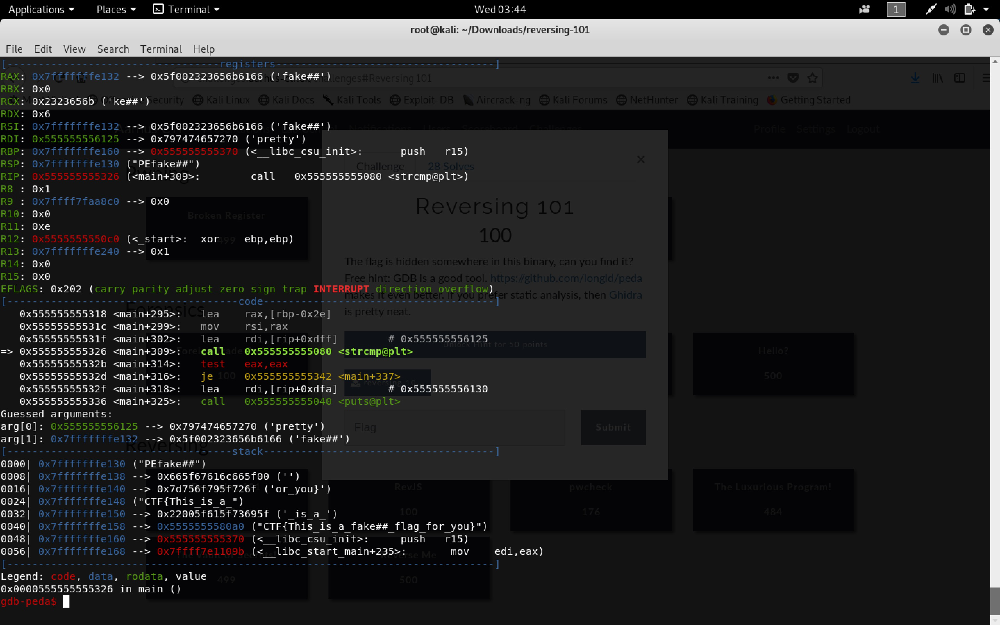
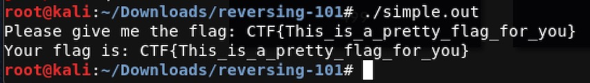

# Reversing 101

The explanation of the exercise that were given was: 
> The flag is hidden somewhere in this binary, can you find it? Free hint: GDB is a good tool. https://github.com/longld/peda makes it even better. If you prefer static analysis, then Ghidra is pretty neat.

Furthermore, we were given a binary file called: *simple.out*


Because of the hint, we know that this challenge can be solved by using GDB. For this writeup I will be using peda, which as explained is an extension to GDB. 

The first thing to do is trying to call the file, to get an idea of what it does. To do this make the file executebale by calling 
```
chmod +x simple.out
```

Then when running the program, it asks for the flag:



Just give it something, it does matter what. We just want to see what it does next.

    
Looks like the programs only function is to take a string as input and check if it matches the correct flag. Lets use GDB, and look for places where our flag is compared to something. To start it write: ```gdb simple.out```. This will start GDB. Then type ```start```. It should look like:



Now write ```n``` and then tap enter (for next). This will execute the next step. Do this until the program asks for the flag. Then give it something random again



Now you should be able to see the string, you just typed, in some of the registers:



If you keep calling next, you will at some point realize that the string: *CTF\{This\_is\_a\_fake\_flag\_for\_you\}* is loaded into the registers to. Lets stop this iteration and try running ```start``` again, where we this type use that flag.

After having done this and you have called next a bunch of times, you will at some point see the following:



When you run some more next and watch what code is being run, you will see a comparison being made. This indicates to us that the flag is to start with *CTF\{This\_is\_a\_*. Now continue running next and you will realise that the length of the flag also has to be 34.



Lets append something at the end (lets use: *CTF\{This\_is\_a\_fake\_flag\_for\_you\}\#\#* and do this again. We now passes the length check, and realizes that the code also checks the end of the string, which turns out should be *\_flag\_for\_you\}*, as can be seen in the below image:



Lets then try with this flag: *CTF\{This\_is\_a\_fake\#\#\_flag\_for\_you\}*. When doing this we will at some point get the following image, which shows us that *fake\#\#* is compared to *pretty*:



We therefore know that the flag is: *CTF\{This\_is\_a\_pretty\_flag\_for\_you\}*



---
*Writeup by Jesper Brink*