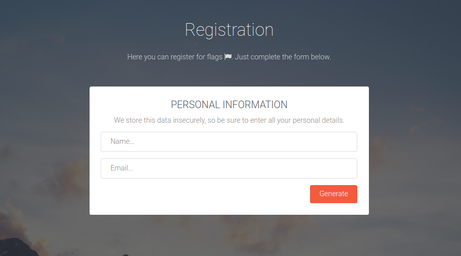
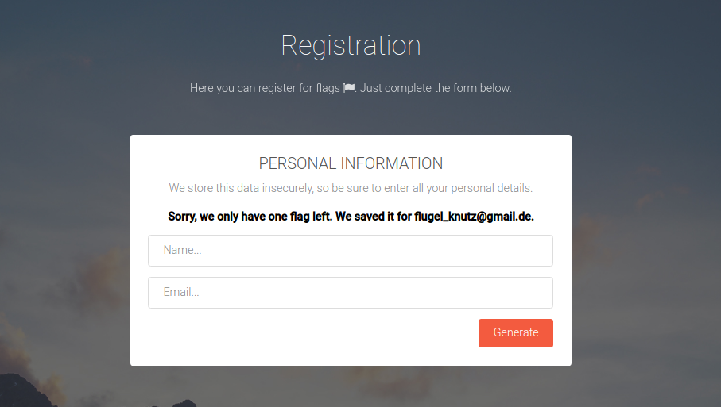
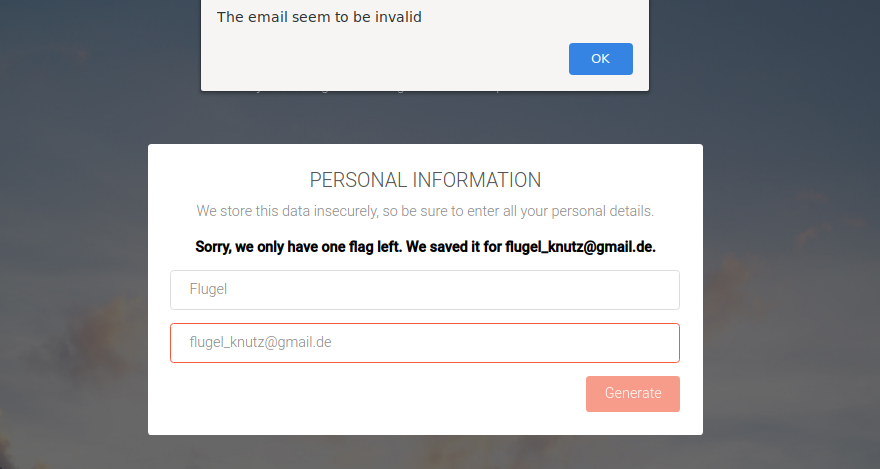
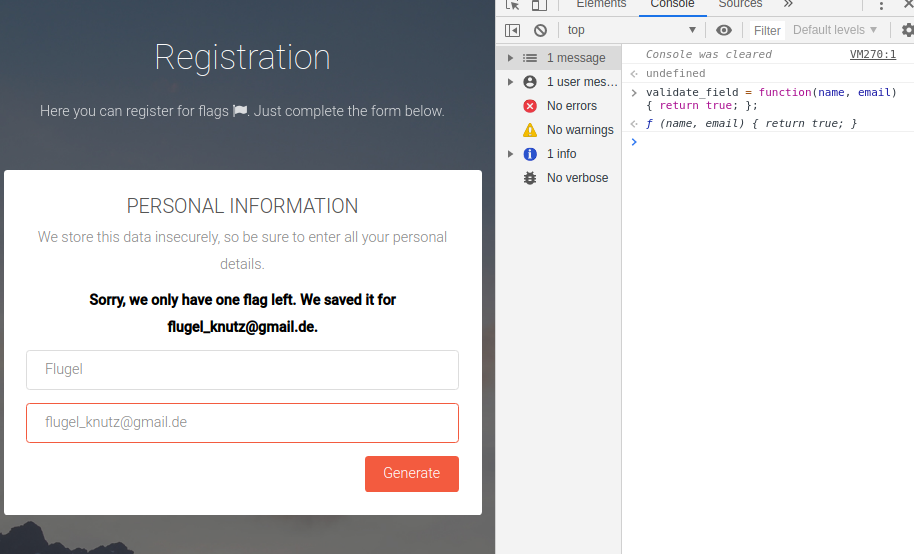
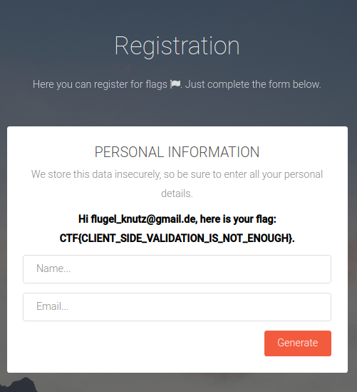

# Registration
## Challenge Description
> Just register for a flag - if they have more left at least.

## Solution
We are first presented with the following screen, where we are allowed to input a name and email address.

 

Inputting a name and email address gives us a message back saying that there is only one flag left saved for `flugel_knutz@gmail.com`.

 

Entering this into the prompt gives us a alert saying that the email is invalid.

 

As this is a alert and no page refresh, we can quickly gather it is something client-side that is happening and we can therefore inspect the page sourcecode.
Doing this reveals a file called `validation.js`, which seems like a good place to start!

In that file there is a function called `validate_field(name, val)`, which checks the entered information and validates the email against a regular expression.

```javascript
function validate_field(name, val)
{

    console.log("Named: " + name);
    console.log("Value: " + val);
    switch(name)
    {
        case 'f1-name':
            if(val.length == 0){
                alert("Please provide a name");
                return false
            }
            break;

        case 'f1-email':
            var regex = /^[a-zA-Z0-9]+@[a-zA-Z0-9]+\.[a-zA-Z0-9]+$/
            if(val.length == 0){                
                alert("Please provide a email");
                return false;
            }

            if(!regex.test(val)){
                alert("The email seem to be invalid");
                return false;
            }
            break;
    }
    return true;
}
```

From that regular expression we can see that the client-side validation does not allow `_` as a character in our e-mail.
To bypass this, we can just override the function to always return true!
Simply open your console and input `validate_field = function(name, val) { return true; }`, enter the email and watch as you get the flag!

 
 

---
* Writeup by eyJhb
